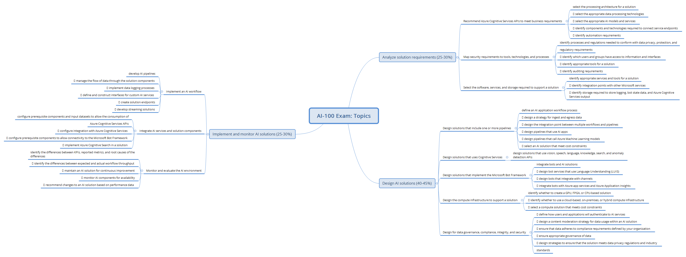

# AI-100-and-AI-track-resources
This repository aims to form a study group to prepare for the Microsoft AI-100 Exam. :microsoft:Here we will share study plans, videos, teaching materials, courses, tips, mind maps and other resources. In addition, it has the purpose of share the AI Track Resources repository collaboratively maintained.

## These are the LinkedIn collaborators of the repository:
- Anderson Soares Furtado Oliveira https://www.linkedin.com/in/andersonfurtado/

## AI-100 Exam Overview

## AI-100 Exam Topics

## Video
- https://www.youtube.com/watch?v=kWLQPMbAGPg&list=PLHytPd_EnpyegblnHPNwhRH1uCRkO9F8r&index=2

# Slides
- https://docs.google.com/presentation/d/1pF-dkJGMzQi1YqFZk9KUqF59QlWRdzX40CCJiJzHUo0/edit?usp=sharing
- https://docs.google.com/presentation/d/12ToFbrPX_wbgT4Kj_KSsbWTUbXbN09ySHKfrHWRwdr0/edit?usp=sharing
